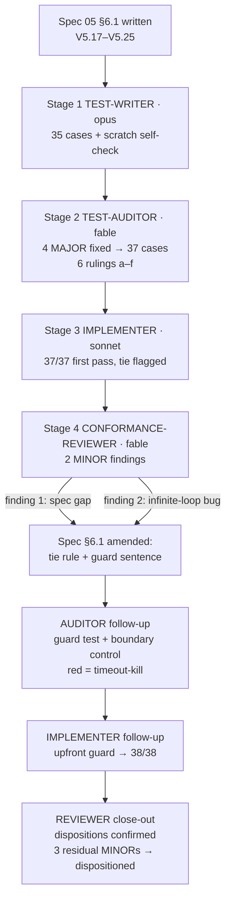
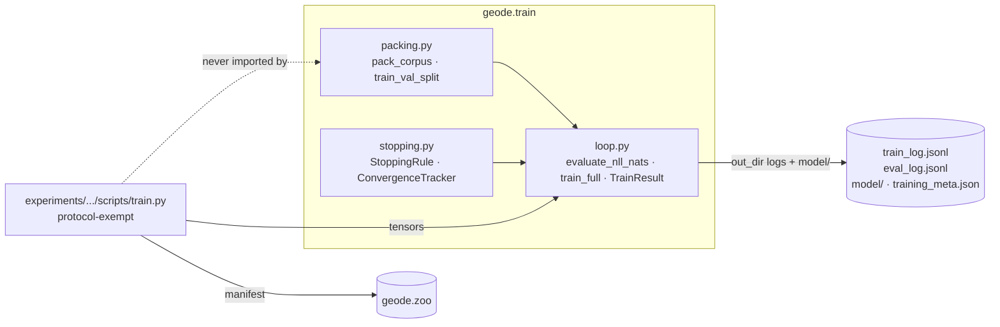
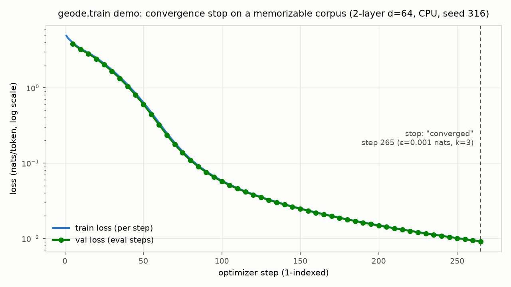

# TRAIN-1 — `geode.train`: corpus packing + full-FT/pretrain trainer

**Date:** 2026-07-16 · **Experiment:** elicit-vs-teach, run-1 infrastructure
· **Spec:** `specs/05-elicit-vs-teach.md` §6 + §6.1 (V5.17–V5.25), §6.2
(exempt surface) · **Plan:** PLAN.md TRAIN-1 block.

**Stage roster (owner decision this session — fable reserved for review
stages):** TEST-WRITER = opus · TEST-AUDITOR = fable · IMPLEMENTER =
sonnet · CONFORMANCE-REVIEWER = fable. Rationale: the 2026-07-12 audit
showed the top tier pays off in review stages; TRAIN-1 confirmed it
again (see stage 4 — the one real bug of the task was found by the fable
reviewer, and it was structurally invisible to tests).

## 1. Decisions made

1. **Separate `geode.train` module instead of extending
   `geode.edl.loop.train_prequential`.** Why: EDL-3's loop carries
   validated pre-update/prequential guarantees (V1.3, V1.7); bolting
   full-model snapshots, val-loss stopping, and multi-epoch pretraining
   onto it risks the validated path for no gain. Rejected alternative:
   one shared trainer with modes — more coupling, spec-01 edits, zero
   reuse of the parts that actually matter (masking arrives only with
   runs 2–4).
2. **Pretrain mode only (loss over all next-token positions).** Runs 2–4
   need label-masked SFT; run 1 does not. Scope was cut to what run 1
   needs; the SFT mode will route through `geode.edl.masking.label_mask`
   when those runs are cut. Rejected: implementing masking now — code
   without a consuming run or test pressure.
3. **Module is zoo-free and datasets-free.** `geode.train` consumes
   in-memory token tensors; registration and HF downloads live in the
   protocol-exempt launch script. Why: keeps the library testable on CPU
   with zero network and keeps provenance concerns in one place.
   Enforced by PLAN acceptance greps.
4. **Zoo `experiment` block rides as preserved unknown fields** (spec 00
   V0.2 guarantees round-trip) rather than schema-validated now. Why: the
   validation deserves its own small task with spec-00 edits + tests;
   blocking run-1 code on it buys nothing today. Deferred task noted in
   §6 loose ends.
5. **Stopping = ε/k convergence tracker with strict `>` improvement,
   unconditional True-latch, NaN → ValueError.** ε, k values themselves
   stay OPEN(3); the mechanism is what run 1 needs pinned.
6. **1-indexed steps; eval at multiples of `eval_every` ∪ {final step}.**
   Auditor ruling: 0-indexing would imply a pre-training eval at step 0
   that the spec nowhere requires.
7. **Tie rule: `converged` wins over `max_steps` on the same final-step
   eval.** Implementer's design call, reviewer adjudicated it correct
   (mislabeling would misreport run health in persisted artifacts), spec
   §6.1 amended same day so the behavior is pinned, not folklore.
8. **Upfront `ValueError` when `len(train_seqs) < batch_size`** (strict;
   equality trains). Origin: reviewer finding #2 — see stage 4. Spec
   amended; test pins both sides of the boundary.
9. **`training_meta.json` config-echo keys pinned in spec** after the
   auditor flagged "echoing the config" as untestable. The echo stays
   deliberately untested (asserting a layout would overfit);
   CONFORMANCE-REVIEWER verifies it by inspection — and did.
10. **Config placeholders, not guesses presented as decisions.** Every
    unpinned pretrain hyperparameter in `run1_pretrain.yaml` carries an
    `OPEN(11)` comment; OPEN(8) (pretrain vs external checkpoint) stays
    with the mentor. The script's `--confirm-cost` refusal is the
    backstop against spending on placeholders.
11. **`pyyaml` promoted to an explicit dependency** (was transitive via
    `datasets`); the launch script parses YAML, and load-bearing
    transitive deps are how environments rot.
12. **Cost estimate = 6·N·tokens FLOPs over configured GPU
    throughput/utilization/price**, recomputed from the actually-packed
    corpus before asking for `--confirm-cost`. Crude by design — it
    exists to force a look at the number, not to be right to 10%.

## 2. Stage-by-stage account

**Stage 1 — TEST-WRITER (opus).** Input: spec §6/§6.1 + PLAN test list
only (guard-blocked from `geode/`). Output: 3 files, 35 collected cases
(17 mandated names + extras via parametrization). The standing
self-check rule (scratch reference implementation, from the 2026-07-12
feedback memory) caught a real bug before it could hide: the launch
prompt misdescribed the fixture tokenizer's vocab mapping
(`"t4"→4`; conftest truth is `t{i}→i+4`), which would have silently
inverted every packing stream expectation. Writer pinned the mapping
with in-test precondition asserts. Six ambiguities flagged for the
auditor rather than resolved silently (step indexing, round ties, latch
semantics, `best_val_nats` definition, `checkpoint_dir` strictness,
no-mutation reading).

**Stage 2 — TEST-AUDITOR (fable).** Adjudicated all six ambiguities
(rulings recorded in test comments where they bind). Four MAJOR
findings, all fixed in-place:
1. "No special tokens added" had zero enforceable coverage — an
   implementation tokenizing with defaults passed everything yet would
   corrupt real Llama packing with per-document BOS. Added a
   BOS-adding-tokenizer test with a hand-derived stream.
2. Eval-log values were never tied to real model state — arbitrary
   finite logged values passed V5.21–V5.25. Strengthened V5.24: last
   eval record at `final_step`, its value ≈ reloaded checkpoint's NLL,
   `best_val_nats == min(eval_log)` under an eps=0 run.
3. `max_steps=None` contract sentence untested (None-crash or →0
   coercion would ship). Added a bounded-runtime construction.
4. Tracker latch under-tested; pinned unconditional True-after-stop.
Plus minors: repo `ruff format` conformance; grad_norm pre-clip is
schema-level-only testable (full verification would overfit — recorded);
`training_meta.json` "config echo" flagged as untestable → spec pinned
the key set the same day. Result: 37 cases.

**Stage 3 — IMPLEMENTER (sonnet).** Four files, exactly the §6.1
surface. All 37 tests passed on the first complete run; no test
modifications requested. Notable implementation properties: local
`torch.Generator` seeded from `(seed, epoch)` for per-epoch order
(never global seeding); `evaluate_nll_nats` accumulates Σloss/Σpositions
(batch-size invariant by construction) and restores `model.training`;
checkpoint saved immediately after the loop so the final eval measures
exactly the saved state. One under-determined-by-spec choice flagged
honestly: the converged/max_steps tie (→ stage 4 finding 1).

**Stage 4 — CONFORMANCE-REVIEWER (fable).** Attested items (a)–(f)
clean by inspection (pre-clip norm source, whole-set NLL, determinism
sources, eval-then-save ordering, `add_special_tokens=False`, config
echo). Two MINOR findings:
1. *Spec gap* — the tie behavior was implemented and documented but not
   spec-pinned: "an under-determined spec plus untested behavior is a
   drift channel." Disposition: spec §6.1 amended (converged wins).
2. *Real bug* — `batch_size > len(train_seqs)` ⇒ drop-last yields zero
   batches ⇒ **silent infinite busy-loop** (empirically confirmed with a
   timeout-kill). Tests structurally cannot see it — they would hang.
   Reachable at pilot scale with batch 128. Disposition: spec amended
   (upfront ValueError), auditor added the test **with a boundary
   control** (rows == batch_size must *train*, so an over-strict `<=`
   guard also fails), implementer added the guard as the first statement
   of `train_full` (no side effects on the bad path).

**Close-out.** Reviewer re-verified both dispositions byte-level
(loop.py delta = guard block only; tests delta = the one new test) and
ran the guard test itself: green in 0.06s. Three residual MINORs, all
dispositioned: stale "spec is silent" docstring in loop.py → reworded to
cite spec §6.1 (via IMPLEMENTER); `ruff format` red on the §6.2 launch
script → formatted; provenance of CLAUDE.md/docs/experiments changes →
owner-directed in this session (documentation policy, §6.2 surface, this
log), stated here for the record.

## 3. Tests (38 cases, 25 functions)

| Test (tests/train/) | V | Breakage it catches |
|---|---|---|
| test_pack_sequences_exact_len_and_stream_order | V5.17 | wrong seq slicing, doc order, EOS placement |
| test_pack_drops_short_tail | V5.17 | tail padded/kept ⇒ garbage final sequence |
| test_pack_missing_eos_raises | V5.17 | silent doc-boundary loss with EOS-less tokenizers |
| test_pack_deterministic | V5.17 | hidden randomness in packing |
| test_pack_adds_no_special_tokens *(auditor)* | V5.17 | per-doc BOS corruption with real Llama tokenizer |
| test_pack_seq_len_too_small_raises *(writer extra)* | V5.17 | degenerate seq_len accepted |
| test_split_exact_partition_and_sizes | V5.18 | row loss/duplication; wrong clamped-round n_val |
| test_split_invalid_fraction_raises, test_split_too_few_rows_raises *(extras)* | V5.18 | silent degenerate splits |
| test_split_seeded_deterministic | V5.18 | irreproducible train/val membership |
| test_stopping_plateau_stops_after_exactly_k | V5.20 | off-by-one stopping (wasted or truncated GPU runs) |
| test_stopping_improvement_resets_counter | V5.20 | premature stop despite progress |
| test_stopping_eps_boundary_is_strict | V5.20 | ≥ vs > drift in convergence definition |
| test_stopping_nan_raises | V5.20 | NaN treated as improvement/plateau |
| test_stopping_latches_true_after_stop *(auditor-strengthened)* | V5.20 | post-stop resurrection of a run |
| test_eval_nll_matches_manual_reference | V5.19 | wrong positions/reduction/units in the eval metric |
| test_eval_nll_invariant_to_batch_size | V5.19 | mean-of-batch-means bug |
| test_train_converges_and_stops_on_tiny_corpus | V5.21 | loop can't learn or stopping never fires |
| test_same_seed_identical_logs | V5.22 | nondeterminism ⇒ irreproducible runs |
| test_log_schema_and_eval_step_set (+ edge-cadence extra) | V5.23 | schema drift; wrong eval cadence incl. final-step dedup |
| test_checkpoint_roundtrip_same_val_nll | V5.24 | checkpoint ≠ evaluated state; fabricated eval logs |
| test_max_steps_cap_reason | V5.25 | cap ignored or misreported |
| test_train_batch_larger_than_corpus_raises *(reviewer-driven)* | §6.1 guard | silent infinite busy-loop; over-strict guard (boundary control) |

Module shape:

## 4. Figure

Real CPU demo run of `train_full` (2-layer d=64, memorizable corpus,
ε=1e-3, k=3, eval_every=5): converged at step 265, best val 0.0101
nats. Evidence that the stopping rule fires in practice, the eval
cadence lands where V5.23 pins it, and the logs are plot-ready as-is —
the same code path run 1 will use.

## 5. Verification evidence

- `pytest tests/train -q` → **38 passed** (~0.9 s).
- Full suite `pytest -q` → **242 passed**, 9.5–13.6 s wall, CPU-only —
  well inside the <~2 min budget.
- `ruff check .` → clean; `ruff format --check .` → 38 files formatted
  (after formatting the §6.2 script).
- Greps: no `cuda` literals in `geode/train` or `tests/train`; no
  `geode.zoo` / `datasets` imports in `geode/train` (docstring mentions
  only); `manual_seed` only on local `torch.Generator`s.
- Red-state evidence preserved in stage transcripts: pre-implementation
  collection errors (`ModuleNotFoundError: geode.train`), guard-test
  timeout-kill (exit 124) before the guard landed.

## 6. Loose ends

- **OPEN(8)** — pretrain vs external TinyStories checkpoint: mentor.
  **OPEN(11)** — pretrain hyperparams + tokenizer access: pin before any
  `--confirm-cost` spend. Both marked in `run1_pretrain.yaml`.
- **Deferred task:** spec-00 `experiment`-block validation (spec 05 §4);
  until then the block rides as V0.2-preserved unknowns.
- **Deferred mode:** label-masked SFT in `train_full` for runs 2–4, via
  `geode.edl.masking` (spec 05 §6, decision 2).
- `export_hf.py`, gates script, and the run-2+ configs are future §6.2
  work; nothing in this task uploads or spends.
- Known crudeness, accepted: cost model MFU guess (0.35) and
  `assumed_epochs_for_estimate` are estimate-only knobs; the manifest
  records the estimate, actuals get written back at run time.
