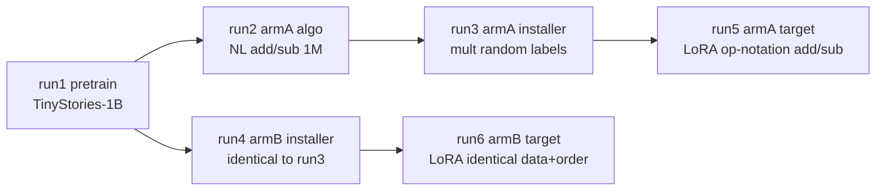

# training-run — experiment card

Mechanistic comparison between a model whose target-task capability is
**latent** (Arm A, `armA_elicit`: algorithm pre-taught, format installed)
and one where it is **absent** (Arm B, `armB_teach`: format installed
only). Design source of truth: [`specs/02-training-run.md`](../../specs/02-training-run.md).
Never reuse the paper's "pre-elicit" (E.1.1) for Arm A's E.2-style
pre-teaching.

## Run DAG



## Status

| Run | run_id | State | Gates |
|-----|--------|-------|-------|
| 1 | `evt-run1-base` | code ready (TRAIN-1); launch blocked on OPEN(8)/OPEN(11) | — |
| 2–6 | — | not yet implemented | G1–G7 pending |

## Layout

- `configs/` — one YAML per run; `common.yaml` shared blocks;
  `pilot/` overlays (pilot uploads go to the separate `-pilot` HF repo).
- `scripts/train.py` — launch a run: registers it in geode.zoo, prints a
  cost estimate, **refuses to train without `--confirm-cost`**.
- `analysis/`, `notes/decisions.md` — filled as runs land; pilot outcomes
  close spec 02 OPEN items in `notes/decisions.md` first, then the spec.

## Launching run 1 (once OPEN(8)/OPEN(11) are pinned)

```bash
export GEODE_STORE=/path/to/store
python scripts/train.py --config configs/run1_pretrain.yaml            # prints cost, refuses
python scripts/train.py --config configs/run1_pretrain.yaml --confirm-cost
# pilot-scale end-to-end first (spec 02 §11):
python scripts/train.py --config configs/run1_pretrain.yaml \
  --override configs/pilot/run1_pretrain.yaml --confirm-cost
```

Implementation history for every task lives in `docs/impl-logs/`.
