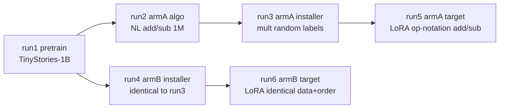

# training-run — experiment card

Mechanistic comparison between a model whose target-task capability is
**latent** (Arm A, `armA_elicit`: algorithm pre-taught, format installed)
and one where it is **absent** (Arm B, `armB_teach`: format installed
only). Design source of truth: [`specs/02-training-run.md`](../../specs/02-training-run.md).
Never reuse the paper's "pre-elicit" (E.1.1) for Arm A's E.2-style
pre-teaching.

## Run DAG



## Status

Live run/gate status lives in [`EXPERIMENTS.md`](../../EXPERIMENTS.md);
decision history in `notes/decisions.md`.

## Layout (lifecycle split 2026-07-24; archive reorg 2026-07-29)

- `configs/` — live YAMLs only at top level: `common.yaml` (walk-up target),
  `lr_pin.yaml`, `eval_*.yaml`, `llama_probe100k_*.yaml`;
  `pilot/` holds the ACTIVE llama10 pilot set.
  `archive/{runs,phase2,phase3}/` — closed run/phase configs, byte-identical,
  frozen. `sweeps/{llama9,dose_cal,p2,target_pilot,target_1m}/` — closed
  pilot sweeps. Config VALUES in archives are still load-checked by
  `tests/experiments/scripts/test_config_completeness.py` under the
  `load_config` walk-up.
- `datagen/` — one-time dataset + tokenizer generation (outputs frozen:
  full datasets on HF `mhieuuu/elicit-vs-teach-arith`, phase-3 local-only;
  tokenizer committed under `tokenizer/`).
- `scripts/` — LIVE GPU/box operations only: trainers, gates, relay,
  monitoring, box provisioning (`find_box.sh`, read-only vast.ai search),
  `launch_llama_probe100k.sh`. Cost paths refuse without `--confirm-cost`.
  `scripts/archive/` — retired launchers +
  one-offs, frozen byte-identical, not re-runnable as-is (internal paths
  predate the reorg — see the path map atop `notes/decisions.md`).
  Load-bearing pins that must NOT move: `box_onstart.sh` (vast.ai template
  references it verbatim), sibling imports among live trainers.
- `analysis/` — CPU post-hoc drivers (→ `geode-store/results/`) and
  plotting; figures land in `analysis/figures/` (gitignored; tracked record
  in `manifests/figures.md`).
- `manifests/` — tracked per-family records (rows, `order_hash`, file
  sha256, provenance, relay status) for the gitignored `data/**` and figure
  artifacts.
- `notes/` — `decisions.md` running log (index + path map at top); pilot
  outcomes close spec 02 OPEN items there first, then the spec. Operator
  runbooks live in repo-root `docs/runbooks/`.
- `_lib/` — shared trainer boilerplate (`REPO_ROOT`, `load_config`, the
  phase banner, `git_commit`), single-sourced from `scripts/train.py`;
  the forward-looking import home for the next trainer/driver.
- `scripts/lib/launch_common.sh` — sourceable launcher glue (`notify`,
  `fail`, `milestone`, `status_of`, `gate_recorded`, `stop_reason_of`) for
  the next launcher to `source` instead of re-declaring inline.

### Deliberate non-goal: per-trainer manifest skeletons

The `manifest_fields` builders in `train.py`, `train_sft.py`,
`train_target.py`, and `train_embedding_warmstart.py` stay **duplicated on
purpose**. Each trainer's manifest carries a different resolved shape
(pretrain vs. SFT vs. LoRA-target vs. embedding warm-start), and those
shapes drift independently as the experiment evolves. A shared builder
would couple unrelated schemas and force every trainer to move in lockstep;
the boilerplate hoisted into `_lib/` is only the truly-common glue, not the
manifest bodies.

## Launching run 1 (once OPEN(8)/OPEN(11) are pinned)

```bash
export GEODE_STORE=/path/to/store
python scripts/train.py --config configs/archive/runs/run1_pretrain.yaml            # prints cost, refuses  # closed run — example syntax only
python scripts/train.py --config configs/archive/runs/run1_pretrain.yaml --confirm-cost  # closed run — example syntax only
```
